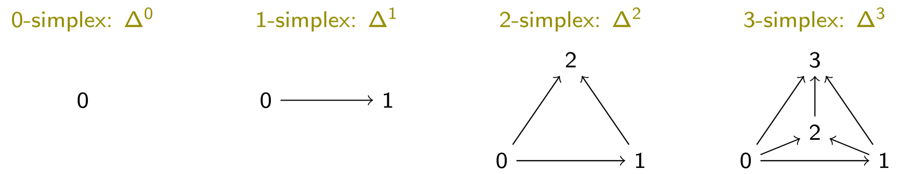
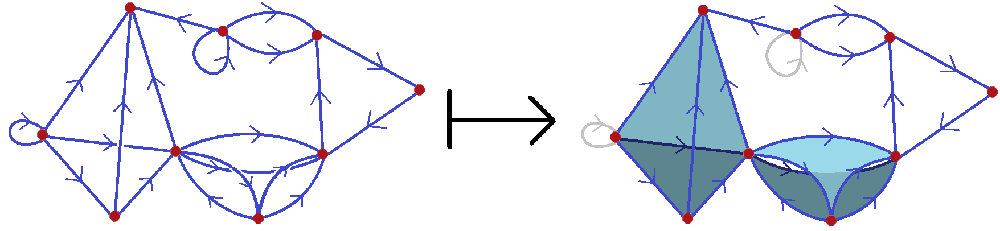
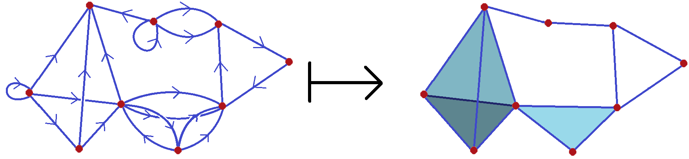
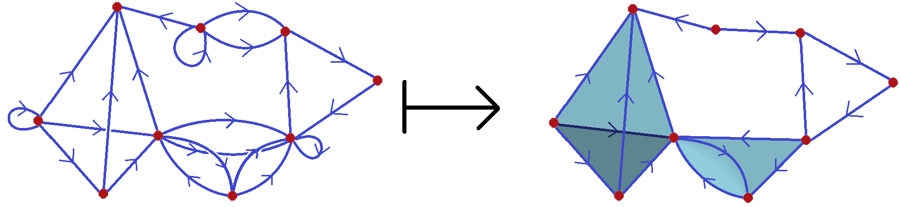
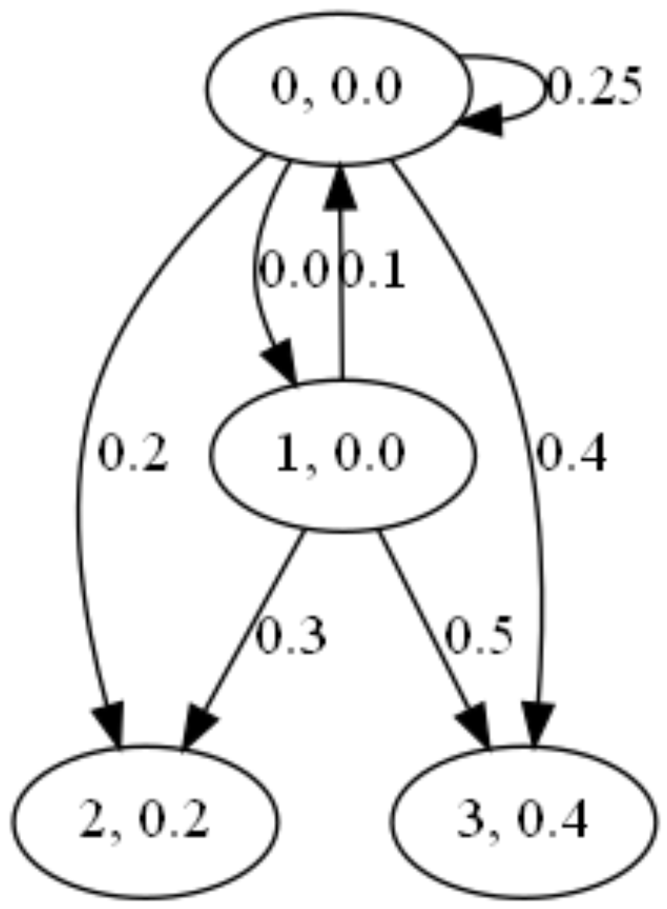
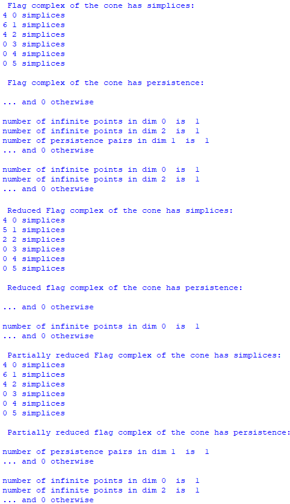

# Singular-simplicial-quiver-homologies


# Table of Contents

1. [Overview](#Overview)
2. [Method](#Method)  
3. [Installation](#Installation)  
4. [Usage](#Usage)
      1. [Example](#Example)
      3. [Reference manual](#Reference-manual)

# Overview

Extending singular homology to quivers in different categories, several homology theories were constructed in [recent work](https://bimsa.net/doc/publication/5381.pdf) of Li, Muranov, Wu, and S. Yau. This code accompanies the [paper](https://arxiv.org/abs/2509.02065), where we make use of isomorphisums between the quiver homologies and the homologies of certain spaces to created effective algorithms for their computation.  Moreover, these constructions are natural and can be applied with persistent homology.

This repository, contains python demonstrations of the algorithms proposed in the [accompanying paper](https://arxiv.org/abs/2509.02065). These implementations are not meant to be especially efficient. However, the ideas behind the algorithm generalises those from [computing persistent homology of directed flag complexes](https://www.mdpi.com/1999-4893/13/1/19) by Lutgehetmann, Govc, Smith, and Levi and should be simiarly addpteable to an [efficient parallel processed implementation](https://github.com/luetge/flagser).

# Method

Given a filtered quiver $`G`$, we provide methods to compute the persistent homology of three associated spaces. For more details on the space and algorithms see the [accompanying paper](https://arxiv.org/abs/2509.02065).

In summary, the digraph $`n`$-simplex consists of vertex set $`\{ 0,1,\dots,n \}`$ and a directed edge $`i \to j`$ whenever $`i,j \in \{ 0,1,\dots,n \}`$ and $`i<j`$.

<p align="center" name="DigraphSimplices" width="20%" height="20%">
      
</p>

A quiver map $`m \colon G \to H`$ consists of a function on the set of vertices $`m_V \colon V_G \to V_H`$ and a function on the set of edges $`m_E \colon E_G \to V_H \coprod E_H`$ sending edges to edges or vertices so that the ends of the arrows agree with the function $`m_V`$. The stricter notion of a quiver homomorphism $`h \colon G \to H`$ is a quiver map where the image of $`h_E`$ consists only of edges. Restricting quiver homomorphisms to those that are invective on both vertices and edges recovers the usual notions of quiver inclusion.

The first space we consider is the directed flag complex. A generalisation of the usual directed clique complex of a digraph. Which consists of a $`\Delta`$-set on the vertices of $`G`$ whose $`n`$-dimensional simplices are are formed from inclusions of the digraph $`n`$-simplex into the quiver $`G`$.

<p align="center" name="DirectedFlagComplex" width="20%" height="20%">
      
</p>

The second space we consider is the reduced directed flag complex. Which consists of an abstract simplicial complex on the vertices of $`G`$ with an $`n`$-simplex on a set of $`n`$ vertices whenever there is at least one inclusion of the digraph $`n`$-simplex onto the same set of vertices in $`G`$. In particular, this space has the same homology as the chain complex freely generated by singular digraph maps from the digraph $`n`$-simplex into $`G`$.

<p align="center" name="ReducedDirectedFlagComplex" width="20%" height="20%">
      
</p>

The third and final space we consider is the partial directed flag complex. Which consists of a $`\Delta`$-set on the vertices of $`G`$ locally resampling the directed flag complex in the vicinity of vertices without self loops and the reduced directed flag complex in the vicinity of vertices with self loops. In particular, this space has the same homology as the chain complex freely generated by singular homomorphisms from the digraph $`n`$-simplex into $`G`$.

<p align="center" name="PartialDirectedFlagComplex" width="20%" height="20%">
      
</p>


# Installation

Please note that the due to the use of the *Persistent Homology Algorithm Toolkit (phat)* for persistent homology computations with cell complexes, an earlier version of python and of some packages are presently required.

Required python packages: numpy (version 1.15.2), graphviz (version 0.14.2), phat (version 1.5.0).

Place a copy of "SingularQuiverHomologies.py" in your python path, nothing else is required other than Python 3 (version 3.5.6).


# Usage

Load the *SingularQuiverHomologies* library.

```python
import SingularQuiverHomologies as SQH
```


## Example

This example demonstrates the computation of all three singular simplicial homologies on a filtered quiver consisting of the digraph suspension of a single double edge.  With the addition of an additional loop added at one of the vertices of the double edge later in the filtration. In particular, the flag complex is unaffected by the prescience of the loop and its homology coincides with that of a 2-sphere. The reduced directed flag complex collapses the double edge. Hence is contactable at all filtration values. Finally, the partial directed flag complex collapses the double edge once the loop enters the filtration. Therefore, has the homology of a 2-sphere until filtration value 0.25, after which it is contactable.

```python
import SingularQuiverHomologies as SQH

#double edge cones with loop
edges = [[0,1,0.0],[1,0,0.1],[0,2,0.2],[0,0,0.25],[1,2,0.3],[0,3,0.4],[1,3,0.5]]

quiver = SQH.Edge_list_to_quiver(edges)
SQH.Display_quiver(quiver, file_name = 'MultiEdgeConeQuiver.gv.pdf')


#flag complex
flag_complex = SQH.Directed_flag_complex(quiver, max_dim = 5)

print('\n Flag complex of the cone has simplices:')
for i in range(len(flag_complex)):
        print(len(flag_complex[i]), i, 'simplices')

pairs_by_dim, inf_points_by_dim = SQH.Persistent_homology(flag_complex)

print('\n Flag complex of the cone has persistence:')
print(' ')
for i in range(len(pairs_by_dim)):
        if len(pairs_by_dim[i]) != 0:
                print('number of persistence pairs in dim', i, ' is ', len(pairs_by_dim[i]))
print('... and 0 otherwise')
print(' ')
for i in range(len(inf_points_by_dim)):
      if len(inf_points_by_dim[i]) != 0:
            print('number of infinite points in dim', i, ' is ', len(inf_points_by_dim[i]))
print('... and 0 otherwise')


#reduced flag complex
reduced_flag_complex = SQH.Reduced_directed_flag_complex(quiver, max_dim = 5)

print('\n Reduced Flag complex of the cone has simplices:')
for i in range(len(reduced_flag_complex)):
        print(len(reduced_flag_complex[i]), i, 'simplices')

reduced_pairs_by_dim, reduced_inf_points_by_dim = SQH.Persistent_homology(reduced_flag_complex)

print('\n Reduced flag complex of the cone has persistence:')
print(' ')
for i in range(len(reduced_pairs_by_dim)):
        if len(reduced_pairs_by_dim[i]) != 0:
                print('number of persistence pairs in dim', i, ' is ', len(reduced_pairs_by_dim[i]))
print('... and 0 otherwise')
print(' ')
for i in range(len(reduced_inf_points_by_dim)):
        if len(reduced_inf_points_by_dim[i]) != 0:
                print('number of infinite points in dim', i, ' is ', len(reduced_inf_points_by_dim[i]))
print('... and 0 otherwise')


#partial flag complex
partial_flag_complex = SQH.Partially_reduced_directed_flag_complex(quiver, max_dim = 5)

print('\n Partial flag complex of the cone has simplices:')
for i in range(len(partial_flag_complex)):
        print(len(partial_flag_complex[i]), i, 'simplices')

partial_pairs_by_dim, partial_inf_points_by_dim = SQH.Persistent_homology(partial_flag_complex)

print('\n Partial flag complex of the cone has persistence:')
print(' ')
for i in range(len(partial_pairs_by_dim)):
        if len(partial_pairs_by_dim[i]) != 0:
                print('number of persistence pairs in dim', i, ' is ', len(partial_pairs_by_dim[i]))
print('... and 0 otherwise')
print(' ')
for i in range(len(partial_inf_points_by_dim)):
        if len(partial_inf_points_by_dim[i]) != 0:
                print('number of infinite points in dim', i, ' is ', len(partial_inf_points_by_dim[i]))
print('... and 0 otherwise')
```

The expected outputs of the above code is as follows.

<p align="center" name="ConeQuiver">
      
</p>

<p align="center" name="ConeQuiverOutput">
      
</p>


## Reference-manual


#### &#x1F539; SingularQuiverHomologies.Directed_flag_complex(quiver, max_dim = 4)

Computes the directed flag complex of a given filtered quiver up to the desired dimension.

|  | Variable | Description |
| ------------ | ------------- | ------------- |
| **Parameters:** | **quiver** | Either a list of filtered quiver edges or a 2-tuple consisting of a list of vertices and a list of edges between vertices. Vertices are assumed to be lists containing a numeric integer values begging at 0 and edges are a list of two of these elements. Both vertices and edges contain a filtration value as an additional final entry in the list. |
| | **max_dim** | Non-negative integer indicating the maximum dimension of the boundary matrix to be computed. |
| **Returns:** | | The directed flag complex of the quiver in the form of a delta set. |


#### &#x1F539; SingularQuiverHomologies.Reduced_directed_flag_complex(quiver, max_dim = 4)

Computes the reduced directed flag complex of a given filtered quiver up to the desired dimension.

|  | Variable | Description |
| ------------ | ------------- | ------------- |
| **Parameters:** | **quiver** | Either a list of filtered quiver edges or a 2-tuple consisting of a list of vertices and a list of edges between vertices. Vertices are assumed to be lists containing a numeric integer values begging at 0 and edges are a list of two of these elements. Both vertices and edges contain a filtration value as an additional final entry in the list. |
| | **max_dim** | Non-negative integer indicating the maximum dimension of the boundary matrix to be computed. |
| **Returns:** | | The reduced directed flag complex of the quiver in the form of a delta set. |


#### &#x1F539; SingularQuiverHomologies.Partially_reduced_directed_flag_complex(quiver, max_dim = 4)

Computes the partially reduced directed flag complex of a given filtered quiver up to the desired dimension.

|  | Variable | Description |
| ------------ | ------------- | ------------- |
| **Parameters:** | **quiver** | Either a list of filtered quiver edges or a 2-tuple consisting of a list of vertices and a list of edges between vertices. Vertices are assumed to be lists containing a numeric integer values begging at 0 and edges are a list of two of these elements. Both vertices and edges contain a filtration value as an additional final entry in the list. |
| | **max_dim** | Non-negative integer indicating the maximum dimension of the boundary matrix to be computed. |
| **Returns:** | | The partially reduced directed flag complex of the quiver in the form of a delta set. |


#### &#x1F539; SingularQuiverHomologies.Persistent_homology(space)

Computes the persistent homology of a given delta set or cell complex using the Persistent Homology Algorithm Toolkit (phat).

|  | Variable | Description |
| ------------ | ------------- | ------------- |
| **Parameters:** | **space** | A delta set or more generally a cell complex. |
| **Returns:** | **pairs_by_dim** | List of lists of persistence pairs of filtration values in each dimension. |
| | **inf_points_by_dim** | List of lists of filtration values in each dimension corresponding to each finite persistence pair. |
